Snapshots
=========

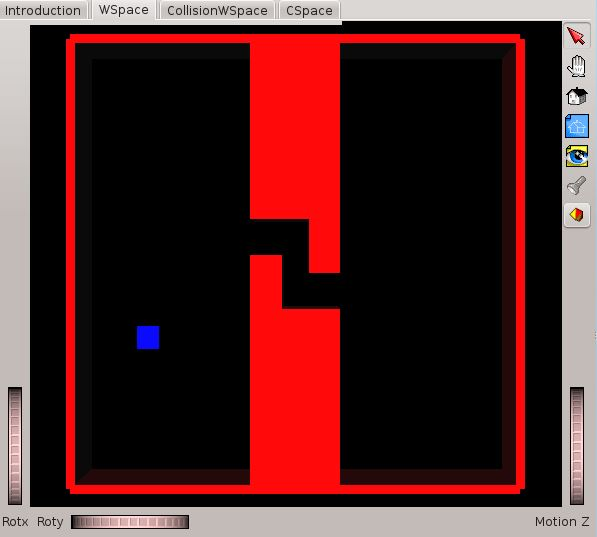
    
.. |HFpassage| image:: images/HFpassage.JPG
    :width: 300pt
    :height: 242pt
    
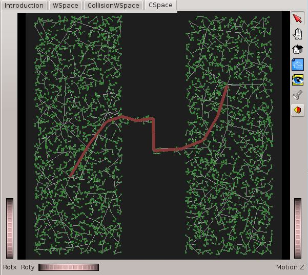

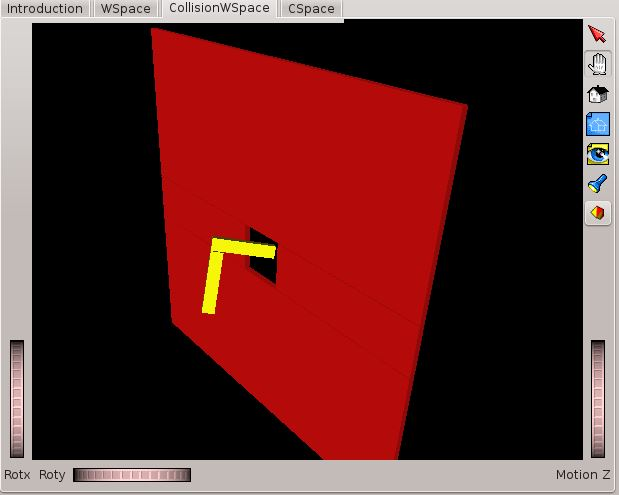

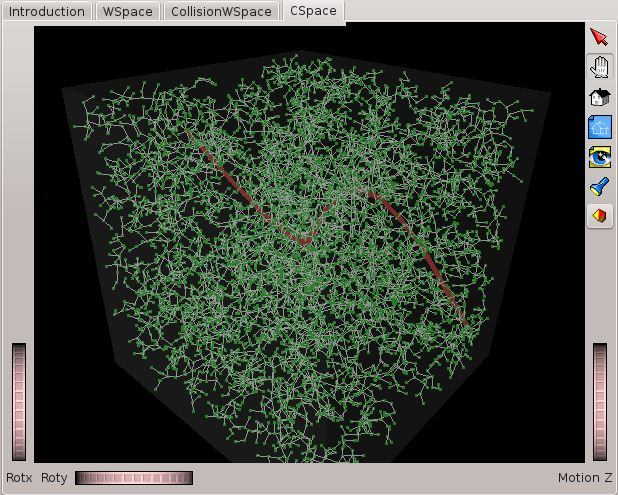

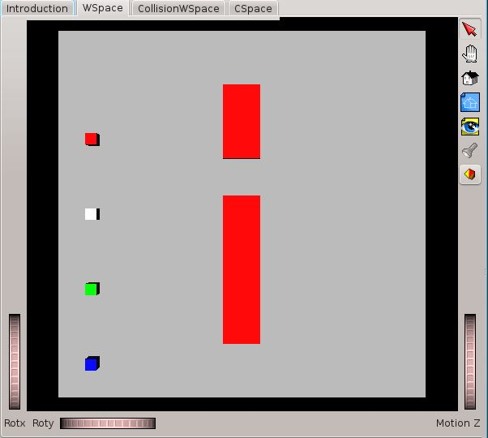
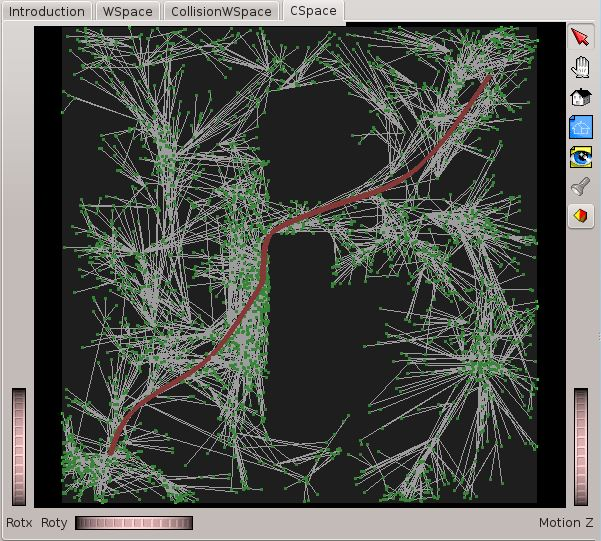
    
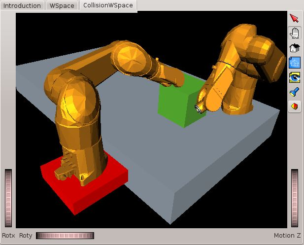
    
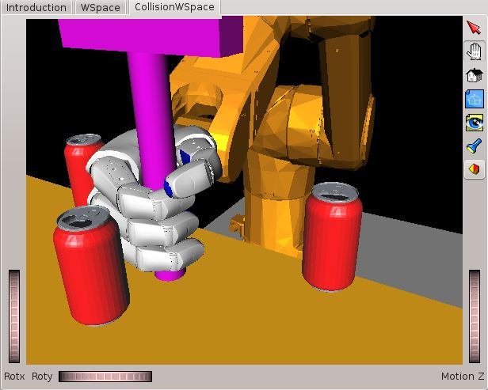
    
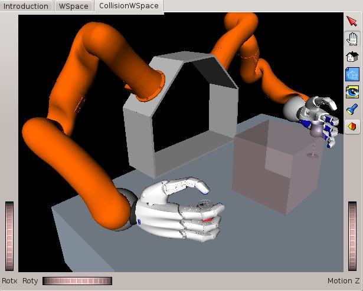
    
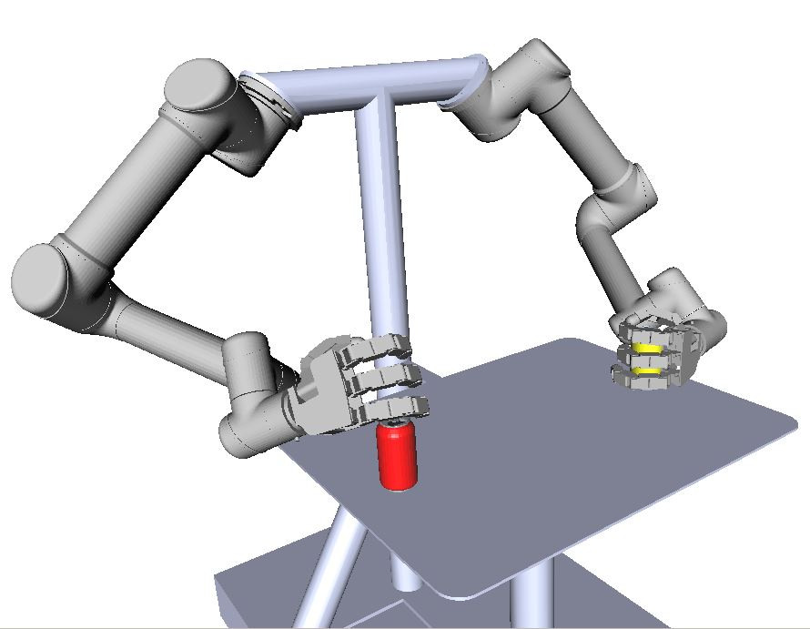
    
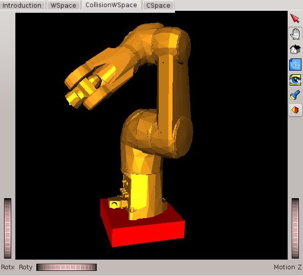
    
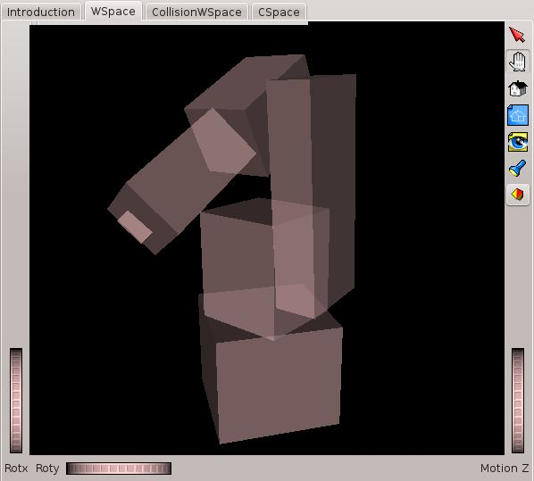
   
   
+------------------------------+---------------------------+
| Narrow Passage               |  HF planner               |
+------------------------------+---------------------------+
| |passage|                    | |HFpassage|               |
+------------------------------+---------------------------+
| Narrow Passage               | PRM planner               |
+------------------------------+---------------------------+
| |passage|                    | |PRMpassage|              |
+------------------------------+---------------------------+
|  L-Hole 6dof                 | RRT planner               |
+------------------------------+---------------------------+
| |holeL|                      |  |holeLcspace|            |
+------------------------------+---------------------------+
| Four 2D robots               | RRT Star                  |
+------------------------------+---------------------------+
| |fourminicubes|              |  |RRTstar_fourminicubes|  |
+------------------------------+---------------------------+
|  Many do.o.f. problems       |                           |
+------------------------------+---------------------------+
|  |IOCcell|                   | |clutteredPMDs|           |
+------------------------------+---------------------------+
| |justin|                     | |UR5_Allegro.JPG|         |
+------------------------------+---------------------------+
|  Visual and collision models |                           |
+------------------------------+---------------------------+
| |workspace|                  | |boxes|                   |
+------------------------------+---------------------------+

.. .. math::
.. 
..     n_{\mathrm{offset}} = \sum_{k=0}^{N-1} s_k n_k
